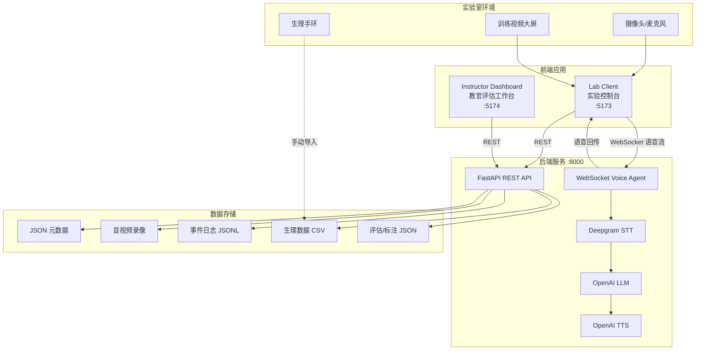
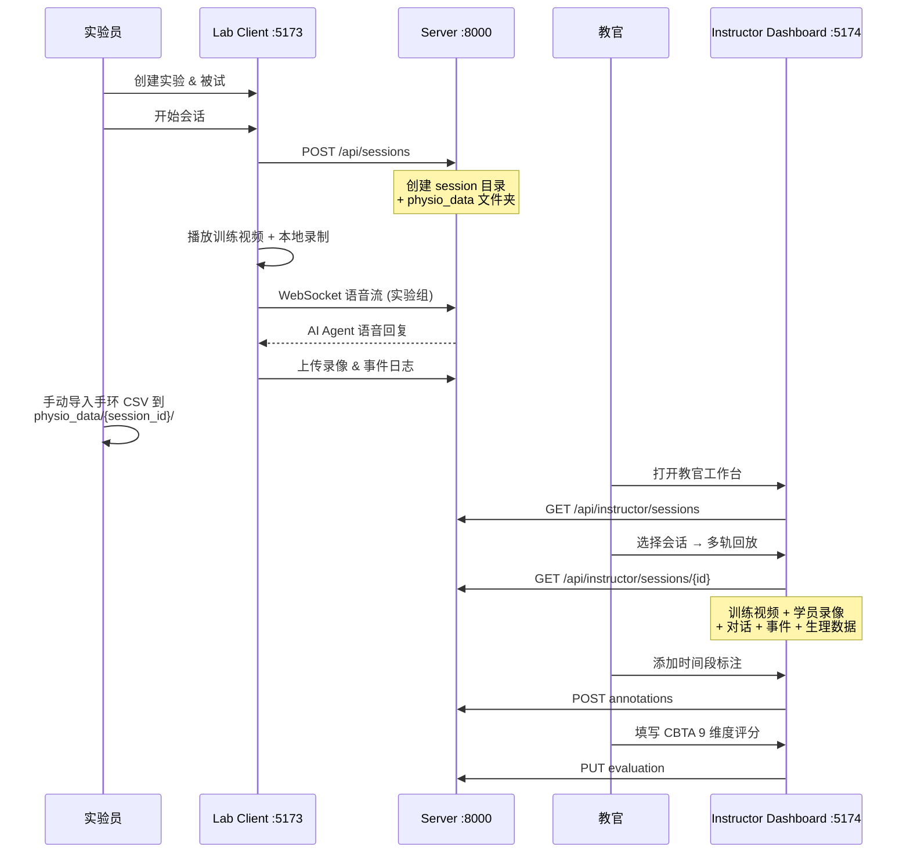

# PCME-Platform — 飞行学员胜任力多模态实验数据采集平台

> Pilot Competency Multi-modal Experiment Platform

本平台用于采集飞行学员在观看飞行训练视频时的多模态交互数据（音视频、语音对话、事件日志、生理信号），并提供教官多轨同步回放与 CBTA 胜任力评分工具，最终构建航空胜任力 Ground Truth 数据集。

---

## 系统架构



## 功能模块

| 模块 | 说明 |
|------|------|
| **Lab Client** (实验控制台) | 实验流程管控、训练视频同步播放、本地摄像头/麦克风录制、事件打点、NASA-TLX 问卷 |
| **Voice Agent** (AI 交互引擎) | 实验组：WebSocket 实时语音管道 (STT → LLM → TTS)；对照组：双人语音转写 + 说话人分离 |
| **Instructor Dashboard** (教官工作台) | 多轨同步回放（训练视频 + 学员录像 + 对话 + 事件 + 生理数据）、时间段标注、CBTA 9 维度评分 |

## 项目结构

```
TEM_Video_Agent/
├── api.env                          # API 密钥配置（不入库）
├── README.md
├── CLAUDE.md
│
└── pcme-platform/
    ├── Makefile                     # 开发命令入口
    ├── package.json                 # pnpm monorepo 根配置
    ├── pnpm-workspace.yaml
    ├── docker-compose.yml           # PostgreSQL（可选）
    │
    ├── server/                      # Python 后端
    │   ├── pyproject.toml           # 依赖声明 (FastAPI, OpenAI, Deepgram…)
    │   └── app/
    │       ├── main.py              # FastAPI 入口 & 路由注册
    │       ├── config.py            # 配置管理（路径、CORS、API key）
    │       ├── store.py             # JSON 文件读写层
    │       ├── api/
    │       │   ├── experiments.py   # 实验管理
    │       │   ├── participants.py  # 被试管理
    │       │   ├── sessions.py      # 会话生命周期
    │       │   ├── voice_agent.py   # WebSocket 语音交互
    │       │   └── instructor.py    # 教官评估 API
    │       ├── schemas/             # Pydantic 数据校验
    │       ├── services/            # STT / LLM / TTS 服务
    │       └── tests/               # pytest 测试
    │
    ├── packages/
    │   ├── lab-client/              # 实验控制台前端 (React + Vite)
    │   │   └── src/
    │   │       ├── components/      # 视频播放器、录制器、问卷等
    │   │       ├── stores/          # Zustand 状态管理
    │   │       └── routes/          # 页面路由
    │   │
    │   └── instructor-dashboard/    # 教官工作台前端 (React + Vite)
    │       └── src/
    │           ├── components/
    │           │   ├── player/      # 多轨播放器、生理图表、对话面板
    │           │   ├── annotation/  # 时间段标注
    │           │   └── scoring/     # CBTA 评分表单
    │           ├── stores/          # 播放状态、评估数据
    │           └── routes/          # 会话列表 / 评审页
    │
    └── data/                        # 运行时数据（.gitignore 排除）
        ├── metadata/
        │   ├── experiments.json
        │   ├── participants.json
        │   ├── sessions/{id}.json
        │   └── evaluations/{id}.json
        ├── recordings/{session_id}/{recording_id}/
        ├── logs/{session_id}/events.jsonl
        ├── physio_data/{session_id}/   # 手环 CSV（手动放入）
        ├── training-videos/            # 训练视频素材
        └── prompts/voice_agent_system.txt
```

## 技术栈

| 层级 | 技术 |
|------|------|
| 后端 | Python 3.11+, FastAPI, Uvicorn, Pydantic |
| 前端 | React 18, TypeScript 5.7, Vite 6, TailwindCSS, Zustand |
| 图表 | Recharts (生理数据折线图、NASA-TLX 雷达图) |
| 语音 | Deepgram (STT), OpenAI (LLM + TTS) |
| 包管理 | pnpm (Node monorepo), uv (Python) |
| 测试 | pytest + pytest-asyncio, Ruff (lint) |

## 环境准备

### 前置依赖

| 工具 | 版本要求 | 安装方式 |
|------|----------|----------|
| **Python** | >= 3.11 | [python.org](https://www.python.org/downloads/) |
| **Node.js** | >= 18 | [nodejs.org](https://nodejs.org/) |
| **pnpm** | >= 8 | `npm install -g pnpm` |
| **uv** | latest | `curl -LsSf https://astral.sh/uv/install.sh \| sh` |

### 1. 克隆仓库

```bash
git clone <repo-url>
cd TEM_Video_Agent
```

### 2. 配置 API 密钥

在项目根目录创建 `api.env`：

```bash
# Deepgram 语音识别（实验组 STT + 对照组说话人分离）
deepgram_api = 'your_deepgram_api_key'
```

设置 OpenAI 环境变量（实验组 LLM + TTS）：

```bash
export OPENAI_API_KEY='your_openai_api_key'
```

> 如果只使用教官工作台回放已有数据，无需配置以上密钥。

### 3. 安装 Python 后端依赖

```bash
cd pcme-platform/server
uv sync --all-extras    # 安装全部依赖（含 dev 工具）
cd ..
```

### 4. 安装 Node 前端依赖

```bash
# 在 pcme-platform/ 目录下
pnpm install
```

### 5. 放置训练视频素材

将训练视频文件（如 `training_video.mp4`）放入：

```
pcme-platform/data/training-videos/
```

同时将相同文件放入实验控制台的静态目录：

```
pcme-platform/packages/lab-client/public/training-videos/
```

## 启动运行

需要同时启动 **后端** + **所需的前端**，分三个终端窗口：

```bash
# 终端 1：启动后端服务（端口 8000）
cd pcme-platform
make server-dev

# 终端 2：启动实验控制台（端口 5173）— 采集实验时使用
make client-dev

# 终端 3：启动教官工作台（端口 5174）— 回放评估时使用
make instructor-dev
```

启动后访问：

| 服务 | 地址 | 用途 |
|------|------|------|
| 后端 API | http://localhost:8000 | REST API + WebSocket |
| 实验控制台 | http://localhost:5173 | 实验采集界面 |
| 教官工作台 | http://localhost:5174 | 评估回放界面 |

## 实验数据流程



## 生理数据接入

### 时间对齐

手环和实验电脑均使用 NTP 同步的系统时钟，CSV 中的 `timeStamp` 列与实验系统的 `anchor_timestamp_ms` 使用相同的 Unix 毫秒纪元，无需额外校准。系统直接用 session 起始时间作为零点换算相对秒数。

### CSV 文件放置

实验时系统会自动为每个 session 创建 `data/physio_data/{session_id}/` 文件夹。

从手环软件导出特征 CSV 后，按传感器类型放入对应文件夹：

```
data/physio_data/{session_id}/
├── PPG/
│   └── xxx_PPG_Features.csv     # 心率、HRV、呼吸率
├── GSR/
│   └── xxx_GSR_Features.csv     # 皮肤电导
├── ACC/
│   └── xxx_ACC_Features.csv     # 加速度（体动）
└── GYRO/
    └── xxx_GYRO_Features.csv    # 陀螺仪（腕转）
```

### 展示通道

系统会自动解析以下特征并在教官工作台展示：

| 传感器 | CSV 列名 | 展示名称 | 单位 |
|--------|----------|----------|------|
| PPG | HR_PPG | Heart Rate | bpm |
| PPG | RMSSD_PPG | HRV (RMSSD) | ms |
| PPG | Resp | Respiration Rate | /min |
| PPG | LHR_P_PPG | LF/HF Ratio | — |
| GSR | mean_SCL | Skin Conductance Level | μS |
| GSR | num_SCR | SCR Count | — |
| ACC | totalAcc | Body Movement | g |
| GYRO | totalGyro | Wrist Rotation | °/s |

## 开发命令

```bash
# ---- 后端 ----
make server-dev          # 启动开发服务器（热重载）
make server-test         # 运行 pytest 测试
make server-lint         # Ruff 代码检查
make server-format       # Ruff 自动格式化

# ---- 实验控制台 ----
make client-dev          # 启动开发服务器
make client-typecheck    # TypeScript 类型检查
make client-build        # 生产构建

# ---- 教官工作台 ----
make instructor-dev      # 启动开发服务器
make instructor-typecheck
make instructor-build
```

## API 端点概览

| 方法 | 路径 | 说明 |
|------|------|------|
| GET | `/api/experiments` | 实验列表 |
| POST | `/api/experiments` | 创建实验 |
| GET | `/api/participants` | 被试列表 |
| POST | `/api/participants` | 创建被试 |
| POST | `/api/sessions` | 创建会话 |
| GET | `/api/sessions/{id}` | 会话详情 |
| PATCH | `/api/sessions/{id}` | 更新会话状态 |
| POST | `/api/sessions/{id}/recordings` | 上传录像 |
| POST | `/api/sessions/{id}/events` | 上传事件日志 |
| POST | `/api/sessions/{id}/questionnaires` | 提交问卷 |
| WS | `/ws/voice-agent/{id}` | 语音交互 WebSocket |
| GET | `/api/instructor/sessions` | 教官会话列表 |
| GET | `/api/instructor/sessions/{id}` | 教官会话详情（含生理数据） |
| PUT | `/api/instructor/sessions/{id}/evaluation` | 创建/更新评估 |
| POST | `/api/instructor/sessions/{id}/annotations` | 添加时间段标注 |
| PATCH | `/api/instructor/sessions/{id}/annotations/{ann_id}` | 更新标注 |
| DELETE | `/api/instructor/sessions/{id}/annotations/{ann_id}` | 删除标注 |

## CBTA 胜任力评分维度

教官使用 ICAO CBTA 9 维度对学员表现进行评分（1-5 分）：

| 维度 | 英文 |
|------|------|
| 沟通 | Communication |
| 领导力与团队合作 | Leadership & Teamwork |
| 情景意识 | Situation Awareness |
| 问题解决与决策 | Problem Solving & Decision Making |
| 工作负荷管理 | Workload Management |
| 知识应用 | Knowledge Application |
| 飞行航径管理（手动） | Flight Path Management (Manual) |
| 飞行航径管理（自动） | Flight Path Management (Automated) |
| 程序应用 | Application of Procedures |

## 常见问题

**Q: 只想用教官工作台回放，不需要 AI 语音功能，还需要配 API key 吗？**
A: 不需要。API key 仅在实验组采集语音交互时使用。

**Q: 训练视频应该放哪里？**
A: 放入 `pcme-platform/data/training-videos/` 即可，后端会通过静态文件挂载自动提供访问。实验控制台还需要在 `packages/lab-client/public/training-videos/` 放一份。

**Q: 手环数据怎么对齐时间轴？**
A: 手环和电脑使用相同的 NTP 时钟源，CSV 中的 `timeStamp` 与系统的 `anchor_timestamp_ms` 都是 Unix 毫秒时间戳，系统直接相减换算为相对秒数，无需额外校准。

**Q: 录像回放时进度条显示 Infinity？**
A: WebM 格式录像可能缺少时长元数据，系统已通过 session 的 `started_at` / `ended_at` 自动计算回退时长。

## License

本项目仅供学术研究使用。

## BrainLink Pro EEG 采集

BrainLink Pro 必须连接运行实验控制台的 Windows 电脑，不能由远程 Linux 服务器直接采集。首次使用，在 `pcme-platform/server/` 运行 `uv sync --extra eeg`；从官方 SDK 取得适配 Python 3.11 的 `BrainLinkParser.pyd`，置于 `server/tools/vendor/BrainLinkParser.pyd`。

在 Windows 蓝牙设置中配对头箍，并确认其**输出** COM 端口（例如 `COM5`）。每次实验前，在独立 PowerShell 窗口运行：

```powershell
cd pcme-platform/server
.\.venv\Scripts\python.exe tools\brainlink_bridge.py --port COM5
```

桥接仅监听 `127.0.0.1:8765`。实验控制台显示“已连接 COMx”后，点击“开始实验”会以本次 session 的 `anchor_timestamp_ms` 自动开始 EEG 记录；点击“结束实验”会封存数据。若桥接或头箍未就绪，控制台不会开始实验。

每个 session 的数据保存为：

```text
data/physio_data/{session_id}/eeg/
├── brainlink_raw.csv       # timestamp_ms, raw_eeg
└── brainlink_features.csv  # 信号质量、注意力、冥想、频段功率、心率等
```

原始 EEG 是高频研究资料，不应直接在回放页面逐点绘制；离线分析前应先做信号质量检查、滤波、伪迹处理及降采样。实验结束后确认 `brainlink_raw.csv` 非空，并检查桥接窗口没有串口或解析错误。
