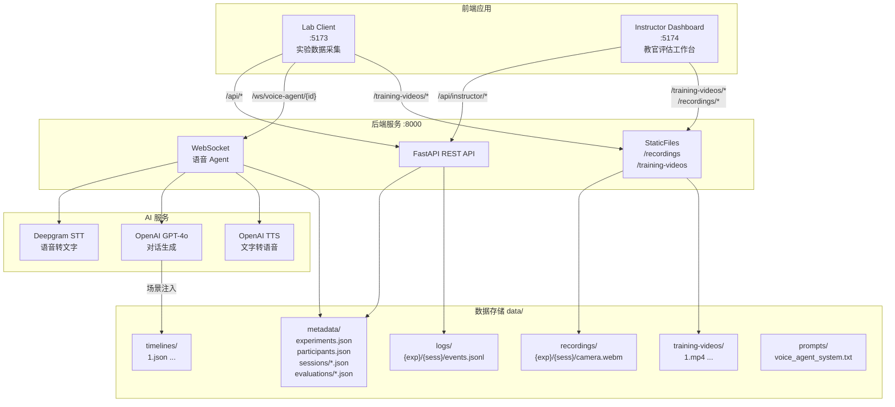
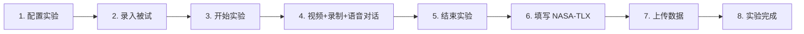
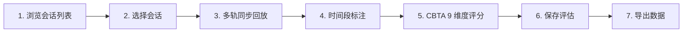
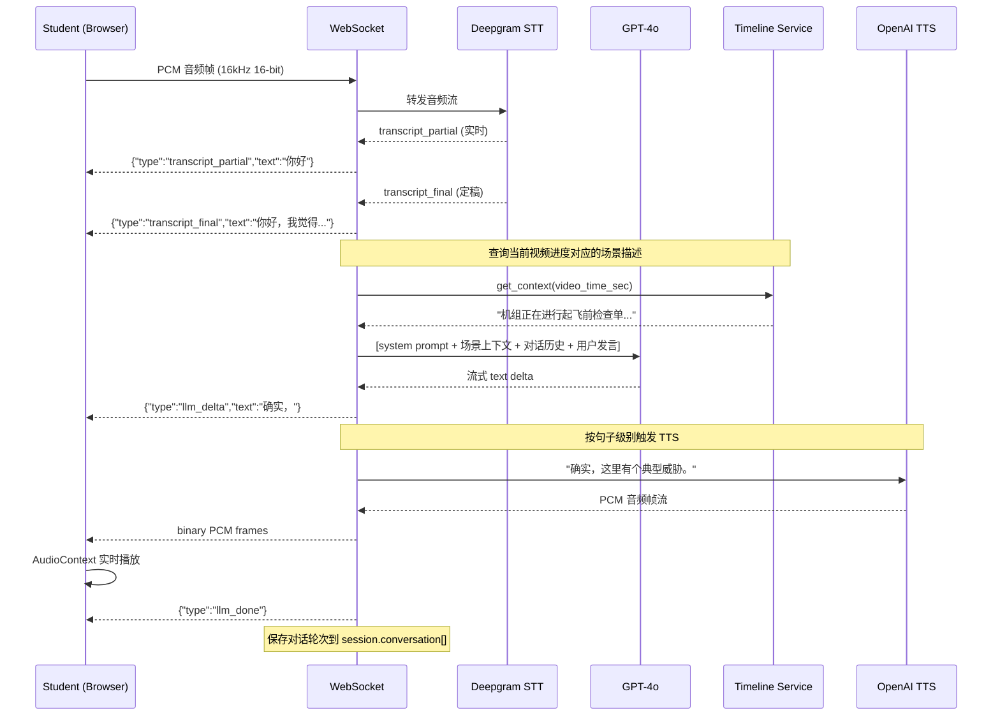

# PCME 平台使用手册

> 飞行学员胜任力多模态实验数据采集与评估平台（Pilot Competency Multimodal Experiment Platform）

---

## 一、系统架构总览



### 技术栈

| 层 | 技术 | 说明 |
|----|------|------|
| 前端 | React 18 + TypeScript + Vite + Tailwind CSS + Zustand | 两个独立应用共享 pnpm workspace |
| 后端 | Python 3.11+ / FastAPI / uvicorn | REST API + WebSocket 双协议 |
| 语音识别 | Deepgram Nova-2 | 流式中文 STT，支持 diarization |
| 对话模型 | OpenAI GPT-4o | 流式生成，TEM 场景感知 |
| 语音合成 | OpenAI TTS-1 | PCM 24kHz 流式推送 |
| 存储 | JSON 文件 + JSONL 事件日志 | 无数据库依赖，实验室内网部署 |
| 包管理 | pnpm (前端) + uv (Python) | |

---

## 二、目录结构

```
pcme-platform/
├── Makefile                            # 开发命令入口
├── package.json                        # pnpm workspace 根
├── pnpm-workspace.yaml
│
├── server/                             # 后端
│   ├── pyproject.toml
│   └── app/
│       ├── main.py                     # FastAPI 入口，路由注册 + StaticFiles 挂载
│       ├── config.py                   # 全局配置（路径、CORS、API key）
│       ├── store.py                    # JSON 文件读写（线程安全）
│       ├── api/
│       │   ├── experiments.py          # 实验 CRUD
│       │   ├── participants.py         # 被试注册
│       │   ├── sessions.py            # 会话管理（状态流转、事件/录像/问卷上传）
│       │   ├── voice_agent.py          # WebSocket 语音 Agent
│       │   └── instructor.py           # 教官评估 API
│       ├── schemas/                    # Pydantic 数据模型
│       │   ├── experiment.py
│       │   ├── participant.py
│       │   ├── session.py
│       │   ├── event.py
│       │   ├── recording.py
│       │   ├── questionnaire.py
│       │   └── evaluation.py           # CBTA 维度 + 标注 + 评估
│       ├── services/
│       │   ├── deepgram_stt.py         # 流式语音识别
│       │   ├── llm_service.py          # GPT-4o 流式对话
│       │   ├── tts_service.py          # 文字转语音
│       │   └── video_timeline.py       # 视频场景上下文注入
│       └── tests/
│           ├── test_api.py             # Phase 1 API 测试（8 项）
│           ├── test_instructor.py      # 教官评估 API 测试（14 项）
│           └── test_voice_agent.py     # 语音 Agent 测试（5 项）
│
├── packages/
│   ├── lab-client/                     # 实验室客户端（被试使用）
│   │   └── src/
│   │       ├── routes/                 # ExperimentSetup → ExperimentSession → Questionnaire → SessionComplete
│   │       ├── components/             # VideoPlayer, LocalRecorder, VoiceChatPanel, PhysioSyncButton, QuestionnaireForm
│   │       ├── core/                   # TimeAnchor, EventLogger, VoiceWebSocket, MediaRecorderManager, AudioCaptureWorklet
│   │       ├── stores/                 # experimentStore, voiceChatStore
│   │       ├── hooks/                  # useVoiceChat
│   │       └── types/                  # api, experiment, event, voice
│   │
│   └── instructor-dashboard/           # 教官评估工作台（教官使用）
│       └── src/
│           ├── routes/                 # SessionList, SessionReview
│           ├── components/
│           │   ├── player/             # MultiTrackPlayer, SyncVideoPlayer, PlaybackControls, TimelineBar, ConversationPanel, PhysioChart
│           │   ├── annotation/         # TimeSpanAnnotator, AnnotationForm, AnnotationList, CompetencyBadge
│           │   ├── scoring/            # CbtaScoringForm, DimensionScoreCard, NasaTlxRadar
│           │   └── display/            # SessionInfoCard
│           ├── stores/                 # sessionListStore, reviewStore
│           └── types/                  # api, evaluation, session
│
└── data/                               # 所有实验数据（统一存储根）
    ├── metadata/
    │   ├── experiments.json            # 实验列表
    │   ├── participants.json           # 被试列表
    │   ├── sessions/                   # 每个会话一个 JSON
    │   │   └── {session_id}.json
    │   └── evaluations/                # 教官评估数据（与会话分离）
    │       └── {session_id}.json
    ├── recordings/                     # 学员录像
    │   └── {exp_id}/{session_id}/
    │       ├── camera.webm
    │       └── microphone.wav
    ├── logs/                           # 事件日志
    │   └── {exp_id}/{session_id}/
    │       └── events.jsonl
    ├── training-videos/                # 训练视频（唯一存放位置）
    │   └── 1.mp4
    ├── timelines/                      # 视频场景描述（供 Agent 上下文注入）
    │   └── 1.json
    ├── prompts/                        # LLM 系统提示词
    │   └── voice_agent_system.txt
    └── exports/                        # 数据导出
```

---

## 三、数据模型

### 3.1 实验（Experiment）

存储于 `data/metadata/experiments.json`（列表）。

| 字段 | 类型 | 说明 |
|------|------|------|
| id | UUID | 自动生成 |
| name | string | 实验名称 |
| description | string? | 实验描述 |
| group_type | "control" \| "experimental" | 对照组（人人讨论）/ 实验组（人机交互） |
| training_video_filename | string | 训练视频文件名，对应 `data/training-videos/` 下的文件 |
| config | object? | 扩展配置 |
| created_at / updated_at | ISO datetime | 时间戳 |

### 3.2 被试（Participant）

存储于 `data/metadata/participants.json`（列表）。

| 字段 | 类型 | 说明 |
|------|------|------|
| id | UUID | 自动生成 |
| student_id | string | 学号（唯一） |
| name | string | 姓名 |
| age | int? | 年龄 |
| gender | string? | 性别 |
| flight_hours | float? | 飞行小时数 |
| demographics | object? | 其他人口学信息 |

### 3.3 会话（Session）

每个会话一个文件：`data/metadata/sessions/{session_id}.json`。

| 字段 | 类型 | 说明 |
|------|------|------|
| id | UUID | 会话 ID |
| experiment_id | UUID | 关联实验 |
| participant_id | UUID | 关联被试 |
| status | enum | created → started → recording → questionnaire → uploading → completed / aborted |
| anchor_timestamp_ms | int? | 实验开始时的 Unix 毫秒时间戳，所有时间对齐的基准 |
| training_video_filename | string? | 训练视频文件名（创建时从 experiment 冗余写入） |
| started_at / ended_at | datetime? | 实验开始/结束时间 |
| recordings[] | 嵌入数组 | 录像文件元数据（track_type, file_path, mime_type, file_size, sha256） |
| questionnaires[] | 嵌入数组 | 问卷数据（nasa_tlx 等） |
| event_batches[] | 嵌入数组 | 事件日志批次元数据 |
| conversation[] | 嵌入数组 | AI 对话记录（turn_id, user_text, assistant_text, timestamp） |

### 3.4 事件日志（Events）

存储于 `data/logs/{exp_id}/{session_id}/events.jsonl`，每行一条 JSON。

| 字段 | 类型 | 说明 |
|------|------|------|
| seq | int | 自增序号 |
| ts_abs | int | 绝对 Unix 时间戳（毫秒） |
| ts_video | float | 视频相对时间（秒） |
| event_type | string | video_state_change, video_seeked, recording_start, physio_sync, session_start/end 等 |
| payload | object | 事件详情 |
| source | string | video_player, physio_sync, system 等 |

### 3.5 教官评估（Evaluation）

独立存储于 `data/metadata/evaluations/{session_id}.json`，与会话文件分离避免写冲突。

```json
{
  "session_id": "uuid",
  "instructor_name": "张教员",
  "created_at": "...",
  "updated_at": "...",
  "annotations": [
    {
      "id": "uuid",
      "start_time": 12.5,
      "end_time": 25.0,
      "competencies": ["communication", "situation_awareness"],
      "rating": 4,
      "comment": "学员准确描述了当前威胁因素",
      "created_at": "..."
    }
  ],
  "dimension_scores": {
    "communication": { "score": 4, "comment": "沟通清晰" },
    "situation_awareness": { "score": 3, "comment": "" }
  },
  "overall_comment": "该学员整体表现良好..."
}
```

### 3.6 ICAO CBTA 9 项核心胜任力维度

| Key | 中文名 | 评分说明 |
|-----|--------|----------|
| communication | 沟通 | 有效传递和接收信息 |
| leadership_teamwork | 领导力与团队合作 | 领导和协同能力 |
| situation_awareness | 情景意识 | 感知/理解/预测态势 |
| problem_solving | 问题解决与决策 | 识别问题并正确决策 |
| workload_management | 工作负荷管理 | 任务优先级和资源分配 |
| knowledge_application | 知识应用 | 理论应用于实际 |
| flight_path_manual | 飞行航径管理(手动) | 手动飞行控制精度 |
| flight_path_automated | 飞行航径管理(自动) | 自动驾驶操作能力 |
| application_of_procedures | 程序应用 | SOP/检查单执行 |

评分量表：1=不合格, 2=待改进, 3=合格, 4=良好, 5=优秀

### 3.7 视频场景时间线（Timeline）

存储于 `data/timelines/{视频文件名去后缀}.json`，供语音 Agent 实时注入上下文。

```json
[
  { "start_sec": 0, "end_sec": 120, "description": "机组正在进行起飞前检查单..." },
  { "start_sec": 120, "end_sec": 300, "description": "飞机开始滑行..." }
]
```

---

## 四、API 接口清单

### 4.1 基础接口

| Method | Path | 说明 |
|--------|------|------|
| GET | /health | 健康检查 |
| POST | /api/experiments | 创建实验 |
| GET | /api/experiments | 列出所有实验 |
| POST | /api/participants | 注册被试（student_id 唯一校验） |
| POST | /api/sessions | 创建会话 |
| GET | /api/sessions/{id} | 查询会话详情 |
| PATCH | /api/sessions/{id} | 更新会话状态 |
| POST | /api/sessions/{id}/events | 批量上传事件 |
| POST | /api/sessions/{id}/recordings/upload | 上传录制文件（multipart） |
| POST | /api/sessions/{id}/questionnaires | 提交问卷 |
| WS | /ws/voice-agent/{session_id} | 双向语音 Agent |

### 4.2 教官评估接口

| Method | Path | 说明 |
|--------|------|------|
| GET | /api/instructor/sessions | 会话列表（支持 experiment_id, status, has_evaluation 筛选） |
| GET | /api/instructor/sessions/{id} | 完整详情（含 experiment + participant + events + conversation + evaluation） |
| GET | /api/instructor/sessions/{id}/evaluation | 获取评估（404 if 未创建） |
| PUT | /api/instructor/sessions/{id}/evaluation | 创建/更新评估 |
| POST | /api/instructor/sessions/{id}/annotations | 添加时间段标注 |
| PATCH | /api/instructor/sessions/{id}/annotations/{ann_id} | 更新标注 |
| DELETE | /api/instructor/sessions/{id}/annotations/{ann_id} | 删除标注 |

### 4.3 静态文件服务

| Path | 映射目录 | 说明 |
|------|----------|------|
| /training-videos/* | data/training-videos/ | 训练视频（支持 Range 请求） |
| /recordings/* | data/recordings/ | 学员录像文件 |

---

## 五、环境准备

### 5.1 前置依赖

- **Python 3.11+** 及 [uv](https://github.com/astral-sh/uv) 包管理器
- **Node.js 18+** 及 [pnpm](https://pnpm.io/) 包管理器
- **Chrome 浏览器**（WebM 录制需要 Chrome）
- **OpenAI API Key**（实验组语音 Agent 所需）
- **Deepgram API Key**（已配置在 api.env 中）

### 5.2 安装

```bash
cd pcme-platform

# 后端依赖
cd server && uv sync && cd ..

# 前端依赖
pnpm install
```

### 5.3 配置 API Key

```bash
# OpenAI Key（在运行后端的终端中设置）
export OPENAI_API_KEY="sk-your-key-here"

# Deepgram Key 已在 api.env 中配置，无需额外操作
```

### 5.4 准备训练视频

将训练视频文件放入 **`data/training-videos/`** 目录：

```bash
ls data/training-videos/
# 1.mp4   ← 当前已有的训练视频
```

> 注意：Lab Client 和 Instructor Dashboard 都通过后端 StaticFiles 加载训练视频，
> **视频只放 `data/training-videos/` 这一个位置**。

如需场景上下文注入（让 AI Agent 知道当前视频播放到什么内容），需编写对应的时间线文件：

```bash
# 文件名 = 视频文件名去后缀 + .json
# 例如视频 1.mp4 → 时间线 data/timelines/1.json
```

---

## 六、启动服务

需要打开 **2~3 个终端**：

```bash
# 终端 1：后端服务
cd pcme-platform
export OPENAI_API_KEY="sk-your-key-here"
make server-dev
# 服务运行于 http://localhost:8000
# Swagger 文档：http://localhost:8000/docs

# 终端 2：实验室客户端（采集数据用）
make client-dev
# 运行于 http://localhost:5173

# 终端 3：教官评估工作台（标注评分用）
make instructor-dev
# 运行于 http://localhost:5174
```

---

## 七、实验流程（Lab Client）

### 7.1 流程总览



### 7.2 详细操作步骤

#### 第 1 步：配置实验

打开 http://localhost:5173，进入实验配置页面。

1. **实验名称**：填写本次实验的标识名（如 "TEM实验-批次03"）
2. **实验组别**：
   - **对照组（人人讨论）**：仅做语音转录 + 说话人分离，不触发 AI 对话
   - **实验组（人机交互）**：完整 STT → GPT-4o → TTS 语音 Agent 管道
3. **训练视频文件名**：填入 `data/training-videos/` 下的视频文件名（如 `1.mp4`）
4. 点击 **"下一步"**

#### 第 2 步：录入被试信息

1. **学号**（必填，需唯一）
2. **姓名**（必填）
3. **年龄、性别、飞行小时数**（可选）
4. 点击 **"开始实验"**，系统自动创建会话并跳转到实验页面

#### 第 3 步：开始实验

进入 `/session` 页面后：

1. 点击 **"开始实验"**（绿色按钮）
2. 浏览器弹出权限请求 → **允许摄像头和麦克风**
3. 系统开始：
   - 锚定时间戳（anchor_timestamp_ms），所有后续时间以此为基准
   - 启动摄像头+麦克风录制
   - 训练视频开始播放
   - 会话状态变为 `recording`

#### 第 4 步：实验进行中

页面布局：
- **左侧 3/4**：训练视频播放器
- **右侧 1/4**：摄像头预览 + 语音对话面板 + 控制按钮

**语音对话**（实验组）：

1. 点击 **"开始语音对话"**（蓝色按钮），WebSocket 连接建立
2. 状态灯变绿 → 对着麦克风说中文
3. 实时转写显示在面板中（蓝色半透明气泡）
4. 停顿约 1.2 秒后，转写定稿 → AI 流式回复（灰色气泡）+ 语音播放
5. AI 说话时出现 **"打断"** 按钮，可随时打断
6. 进行多轮自然对话

**语音转录**（对照组）：

- 仅做语音识别 + 说话人分离
- 不触发 AI 回复

**自动记录的数据**：
- 事件日志（视频播放状态、seek、录制开始/停止、生理同步点等）
- 对话轮次（实验组：user_text + assistant_text；对照组：转录文本 + 说话人标签）
- 视频进度同步到 Agent（场景上下文注入）

**生理同步**：

- 右上角 **"生理同步"** 按钮：被试佩戴的手环在需要时按下此按钮
- 记录一个 `physio_sync` 事件到事件日志，用于后续与生理数据对齐

#### 第 5 步：结束实验

1. 如语音对话中，先点击 **"结束对话"**
2. 点击 **"结束实验"**（红色按钮）
3. 录制停止，自动跳转到问卷页面

#### 第 6 步：填写 NASA-TLX 问卷

**NASA-TLX 6 维度主观工作负荷评估**：

| 维度 | 说明 |
|------|------|
| Mental Demand（脑力需求） | 任务在心理上有多大难度 |
| Physical Demand（体力需求） | 任务在体力上有多大要求 |
| Temporal Demand（时间压力） | 感受到多大的时间压力 |
| Performance（绩效表现） | 自认为任务中表现如何 |
| Effort（努力程度） | 需要付出多大努力 |
| Frustration（挫败感） | 过程中感到多大程度的沮丧 |

每项 0-100 分滑块，填完后点击 **"提交问卷"**。

#### 第 7 步：数据上传

问卷提交后自动进入上传阶段：
- 摄像头录像（camera.webm）上传到服务器
- 音频录制（microphone.wav）上传到服务器
- 事件日志最终 flush
- 会话状态流转至 `completed`

#### 第 8 步：实验完成

显示完成确认页面，可继续下一位被试的实验。

---

## 八、教官评估流程（Instructor Dashboard）

### 8.1 流程总览



### 8.2 详细操作步骤

#### 第 1 步：浏览会话列表

打开 http://localhost:5174，进入教官工作台首页。

页面显示所有实验会话的表格，包含：
- 实验名称、被试姓名、组别（实验组/控制组）
- 会话状态（已完成/录制中/已中止等）
- 时长
- 评估状态（已评估/待评估）
- 创建时间

**筛选器**：
- 按状态筛选（全部 / 已完成 / 已中止）
- 按评估状态筛选（全部 / 未评估 / 已评估）

#### 第 2 步：选择会话

点击任一行，跳转到该会话的评审页面 `/review/{sessionId}`。

#### 第 3 步：多轨同步回放

评审页面布局：

```
┌──────────────────────────────────────────────────────────────────┐
│ [← 返回]  实验名 / 被试 / 组别 / 时长 / 日期        [导出评估]  │
├────────────────────────┬───────────────┬─────────────────────────┤
│ 学员录像 (50%)         │ 训练视频 (25%)│ 对话记录 (25%)          │
│ <video> 主时间轴       │ <video> 从属  │ [chat bubbles]          │
│                        │ @ 42.3s       │ 自动跟随时间高亮        │
├────────────────────────┴───────────────┴─────────────────────────┤
│ 播放控制: [|◀] [▶/❚❚] [▶|]  0.5x/1x/1.5x/2x   00:12:34/45:00 │
├──────────────────────────────────────────────────────────────────┤
│ 时间轴：[===|--标注1--|===|--标注2--|============================]│
│ 事件点：  ·  · ·    ·   ·  · ·                                  │
├──────────────────────────────────────────────────────────────────┤
│ [如有 physio_sync 数据] 生理数据折线图 + 游标线                   │
├────────────────────────────────┬─────────────────────────────────┤
│ 标注区 (60%)                   │ 评分区 (40%)                    │
│  标注时间段工具                  │  CBTA 9 维度评分表               │
│  已有标注列表                    │  NASA-TLX 雷达图                │
│  新建标注表单                    │  总评备注                       │
│                                │  [保存评估]                      │
└────────────────────────────────┴─────────────────────────────────┘
```

**多轨同步机制**：

> 为什么学员录像是主时钟？因为训练视频在实验过程中可能被暂停、回拉或重复播放（学员和搭档讨论某个片段时常见），其时间线不是单调递增的。而学员录像从开始到结束连续录制，时间严格单调递增，是唯一可靠的时间基准。

| 轨道 | 同步方式 |
|------|----------|
| 学员录像 | **主时钟**：`timeupdate` 事件驱动全局 `currentTime`，时间轴、标注、评分全部基于此 |
| 训练视频 | **从属同步**：根据事件日志构建 `cameraTime → trainingVideoTime` 映射表，每 500ms 查表对齐。训练视频上方显示当前对应的视频进度（如 `@ 42.3s`） |
| 对话记录 | `(turn.timestamp - anchor_timestamp_ms) / 1000` 转为相对秒数（天然对齐 camera 时间轴），自动高亮当前对话，自动滚动 |
| 事件时间轴 | 按 camera 时间 `(ts_abs - anchor_ms) / 1000` 绘制事件点 |
| 生理数据 | 同样按 camera 时间绘制，垂直游标线跟随 `currentTime` |

**播放控制**：
- 播放/暂停
- 前进/后退 10 秒
- 进度条拖拽跳转
- 倍速切换（0.5x / 1x / 1.5x / 2x）

**对话面板**：
- 点击任一对话轮次 → 视频跳转到该时刻
- 当前对话自动高亮蓝色背景

#### 第 4 步：时间段标注

1. 播放到你要标注的起始位置，点击 **"设起点"**
2. 播放到结束位置，点击 **"设终点"**（时间轴上出现黄色选区预览）
3. 在标注表单中：
   - **选择胜任力维度**（可多选 9 个维度中的任意几个）
   - **评级** 1-5 分
   - **备注**（可选，描述观察到的行为表现）
4. 点击 **"添加标注"**
5. 标注保存后出现在标注列表中，时间轴上显示蓝色区间
6. 可通过垃圾桶图标删除标注

#### 第 5 步：CBTA 9 维度评分

在右侧评分面板中：

1. 填写 **教员姓名**
2. 为 9 个维度逐一打分（1-5 分按钮，点击展开可添加备注）：
   - 沟通、领导力与团队合作、情景意识、问题解决与决策
   - 工作负荷管理、知识应用、飞行航径管理(手动/自动)、程序应用
3. 填写 **总评备注**

**NASA-TLX 雷达图**：如果被试填写了 NASA-TLX 问卷，右下方自动显示六维雷达图，帮助教官参考被试的主观负荷感受。

#### 第 6 步：保存评估

点击 **"保存评估"** 按钮，数据写入 `data/metadata/evaluations/{session_id}.json`。

刷新页面可验证持久化是否成功。会话列表中该条目的评估状态变为 **"已评估"**。

#### 第 7 步：导出数据

点击页面右上角 **"导出评估"** 按钮，下载 JSON 格式的评估数据文件。

---

## 九、AI 语音 Agent 工作原理

### 9.1 实验组模式（experimental）



### 9.2 对照组模式（control）

- 仅做 STT 转录 + 说话人分离（diarization）
- 不触发 LLM / TTS
- 保存转录文本 + 说话人标签

### 9.3 场景感知注入

Agent 不是盲目对话——系统会根据视频播放进度，自动将当前场景描述注入 LLM 上下文：

```
[系统后台信息 - 对用户不可见] 当前视频播放时间: 2分30秒。
剧情提示: 飞机开始滑行，副驾报告跑道能见度低于标准
```

这使 Agent 能围绕正在播放的视频内容进行 TEM（威胁与差错管理）讨论。

### 9.4 Agent 人设

Agent 扮演一名**飞行学员搭档**（非考官），特点：
- 极致简短（1-3 句话，20-40 字）
- 苏格拉底式启发（多反问，少直接给答案）
- 口语化自然（"嗯"、"我觉得"、"确实"）
- 不剧透后续剧情

---

## 十、运行自动化测试

```bash
cd pcme-platform

# 后端全量测试（27 项）
make server-test

# 后端代码检查 + 格式验证
make server-lint

# 后端代码自动格式化
make server-format

# 前端类型检查（Lab Client）
make client-typecheck

# 前端类型检查（Instructor Dashboard）
make instructor-typecheck
```

---

## 十一、检查落盘数据

```bash
cd pcme-platform

# 查看实验列表
cat data/metadata/experiments.json | python3 -m json.tool

# 查看被试列表
cat data/metadata/participants.json | python3 -m json.tool

# 查看所有会话
ls data/metadata/sessions/

# 查看某个会话详情
cat data/metadata/sessions/<SESSION_ID>.json | python3 -m json.tool

# 查看事件日志
cat data/logs/<EXP_ID>/<SESSION_ID>/events.jsonl

# 查看录像文件
ls -lh data/recordings/<EXP_ID>/<SESSION_ID>/

# 查看教官评估
ls data/metadata/evaluations/
cat data/metadata/evaluations/<SESSION_ID>.json | python3 -m json.tool
```

---

## 十二、端到端完整验证

以下是从零开始执行一轮完整实验 + 教官标注的全流程：

### 前置准备

```bash
cd pcme-platform

# 确认训练视频存在
ls data/training-videos/
# 应看到 1.mp4

# 如果有新视频，放入此目录并编写对应时间线
# cp ~/your_video.mp4 data/training-videos/
# 编辑 data/timelines/your_video.json
```

### 启动三个服务

```bash
# 终端 1
export OPENAI_API_KEY="sk-..."
make server-dev

# 终端 2
make client-dev

# 终端 3
make instructor-dev
```

### 执行实验（在 Lab Client 中）

1. 打开 http://localhost:5173
2. 配置实验：名称 "测试实验"，组别 "实验组"，视频 "1.mp4"
3. 录入被试：学号 "S001"，姓名 "张三"
4. 开始实验 → 允许摄像头/麦克风
5. 开始语音对话 → 与 AI Agent 进行 2-3 轮 TEM 讨论
6. 结束实验 → 填写 NASA-TLX 问卷 → 提交
7. 等待数据上传完成 → 显示完成页面

### 验证数据落盘

```bash
# 确认会话已创建
ls data/metadata/sessions/
# 确认事件日志
ls data/logs/
# 确认录像
ls data/recordings/
```

### 教官评估（在 Instructor Dashboard 中）

1. 打开 http://localhost:5174
2. 会话列表中看到刚才的实验会话 → 点击进入
3. 训练视频 + 学员录像 + 对话记录 三轨同步播放
4. 回放过程中：
   - 在关键时间段设起点/终点 → 选维度 → 评级 → 添加标注
   - 重复多次，标注不同片段
5. 为 CBTA 9 个维度打分
6. 填写总评备注 → 保存评估
7. 刷新页面 → 确认数据持久化
8. 点击"导出评估" → 下载 JSON 文件

### 验证评估落盘

```bash
cat data/metadata/evaluations/<SESSION_ID>.json | python3 -m json.tool
# 应包含 annotations[], dimension_scores{}, overall_comment
```

---

## 十三、注意事项

| 项目 | 说明 |
|------|------|
| 浏览器 | 必须使用 **Chrome**，WebM 录制依赖 Chrome MediaRecorder API |
| 网络 | 实验组需要能访问 OpenAI 和 Deepgram API |
| 训练视频位置 | **只放 `data/training-videos/`**，不要放 `public/` 下 |
| 被试学号 | 全局唯一，重复会返回 409 冲突 |
| 并发写入 | 评估数据独立于会话文件，两边不会冲突 |
| 旧会话数据 | 早期创建的会话可能缺少 `training_video_filename` 字段，教官页面会自动从实验配置中回溯获取 |
| 文件大小 | 摄像头录像可达数百 MB，上传需要稳定网络，支持流式写入 + SHA256 校验 |
| 生理数据对齐 | 通过 `anchor_timestamp_ms` + `physio_sync` 事件作为对齐锚点 |
